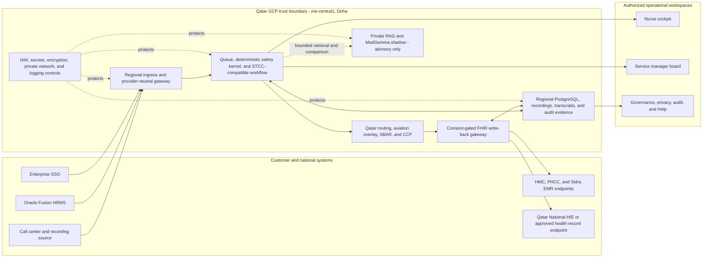

# IST Health Business and Clinical Operations Product Capabilities

**Product:** IST Health Tele-Triage and Clinical Decision Support  
**Company:** IRIS STAR Technologies L.L.C  
**Audience:** Business sponsors, clinical leaders, nursing operations, governance teams, information security, integration teams, and technical evaluators  
**Document purpose:** Product presentation, guided demonstration, capability validation, and implementation-readiness review  
**Architecture baseline:** STCC-compatible, rules-first clinical workflow with a bounded RAG shadow architecture  
**Last capability review:** 18 July 2026  

## 1. Product Positioning

IST Health is a governed employee tele-triage platform designed to help a small clinical team safely manage a large population of employees and dependents. It combines call-center workflow, HRMS-validated identity, acuity-ordered clinical assessment, deterministic safety rules, Qatar-specific routing, nurse-approved communication, operational governance, and an advisory AI shadow layer.

The product is not positioned as an autonomous symptom checker. It is a clinical operations platform in which:

- licensed or approved clinical content supplies the protocol, question sequence, disposition, and advice;
- deterministic code enforces emergency safety floors and prevents unsafe downgrades;
- the nurse remains the clinical decision owner;
- AI retrieves, interprets, compares, explains, and drafts within a fixed boundary;
- every material action can be traced to the user, source content, rule, release, and encounter.

### Product promise

> One governed workflow from incoming employee call to validated clinical disposition, referral, communication, and auditable follow-up.

## 2. Presentation Status Legend

| Status | Meaning in this document |
|---|---|
| **Demo ready** | Available in the current application using synthetic data and suitable for a guided product demonstration. |
| **Foundation implemented** | Backend contract, data model, service, or test foundation exists, but the complete production user journey or external connection is not yet live. |
| **External dependency** | Requires licensed content, customer credentials, a provider connection, customer policy approval, or production infrastructure. |
| **Planned** | Defined in the approved architecture and task plan but not yet implemented end to end. |

No demo-ready label should be interpreted as production clinical approval. Production use requires licensed clinical content, customer governance approval, validated integrations, controlled migration, clinical UAT, and operational sign-off.

## 3. Executive Capability Summary

| Product area | Capability | Current position |
|---|---|---|
| Call operations | Incoming calls, callbacks, hold/resume/end, recordings, and provider-neutral event normalization | Foundation implemented; provider connection is an external dependency |
| Workforce identity | Employee/dependent validation, calculated age, organization context, and eligibility | Demo ready with synthetic HRMS; Oracle tenant connection is an external dependency |
| Nurse operations | One-call-at-a-time cockpit, priority queue, locking, hold, and completion | Demo ready |
| Supervisor operations | Kanban queue board with action stage, safety status, owner, protocol, and routing visibility | Demo ready |
| Clinical workflow | STCC-compatible encounter flow from reason for call to closing and handoff | Demo ready with synthetic/open-source content; licensed STCC import is an external dependency |
| Clinical safety | Deterministic red-floor rules, minimum disposition, and no unsafe AI downgrade | Demo ready and tested |
| Protocol assessment | Search words, guideline candidates, initial assessment, and acuity-ordered triage questions | Search/guideline and triage-question demo ready; initial-assessment backend capability built, with frontend alignment pending; full licensed catalogue is an external dependency |
| Local routing | Pediatric/adult emergency, urgent, routine, self-care, Qatar service routes, and aviation/occupational pathways | Demo ready as configurable synthetic routing; customer route approval remains required |
| Aviation health | Duty context, outstation context, fit-to-fly restriction, and referral overlay | Demo ready as an overlay; production policy approval is required |
| Documentation | Bilingual-ready SOAP/SBAR note, clipboard handoff, evidence trace, and encounter completion | Demo ready; Arabic voice is deferred |
| Follow-up | CCP employee index, separate encounter threads, prior-thread links, approved outbound messages | Demo ready with synthetic data; live channels need credentials |
| Access control | Named users, assigned roles, permission checks, purpose-based reveal, and control-center modules | Demo ready with simulated users; enterprise SSO is an external dependency |
| AI shadow | Bounded retrieval, protocol comparison, disagreement capture, explanation, and learning evidence | Foundation implemented; live governed model endpoint is an external dependency |
| Voice AI | English initial-assessment session, constrained interpretation, correction, nurse validation, and training-example export | Backend components built and tested; alignment into the nurse frontend is pending, together with live telephony/STT/audio/MedGemma |
| Interoperability | Oracle Fusion HRMS, consent-gated EMR/FHIR and Qatar National HIE write-back, call-center, SSO, and communication adapters | FHIR `DocumentReference` dry-run, consent gate, Cerner/Epic targeting, audit, and fallback are implemented; live endpoint onboarding remains an external dependency |
| Qatar data boundary | Doha-region application, database, recording, transcript, audit, and governed AI deployment target | Architecture defined for GCP `me-central1`; service-by-service residency validation and production controls remain required |
| Assurance | Audit evidence, safety-kernel tests, API tests, browser journeys, and Help test-results catalogue | Demo ready; production evidence must be regenerated per release |

## 4. Operating Principles

### 4.1 Rules first, AI second

Clinical safety floors, question ordering, minimum acuity, routing constraints, and final approval are deterministic. AI cannot override or downgrade these controls.

### 4.2 One clinical owner

The assigned nurse owns the encounter. AI suggestions, voice transcripts, RAG matches, and generated notes remain proposals until the nurse validates them.

### 4.3 One active call per nurse

The cockpit prevents a nurse from accidentally progressing two encounters at the same time. A second call can be opened only after the first is completed, released, or placed on hold according to policy.

### 4.4 Approved content boundary

The protocol engine and RAG shadow retrieve only approved, versioned content. RAG cannot invent questions, dispositions, first aid, care advice, or source-of-care routes.

### 4.5 Traceability by design

The system preserves the selected protocol, content release, answers, rule results, AI comparison, nurse decision, override rationale, communication approval, and handoff note.

## 5. End-to-End Business and Clinical Flow

```mermaid
flowchart LR
    A["Incoming call or callback"] --> B["Employee or dependent identity"]
    B --> C["HRMS validation and calculated age"]
    C --> D["Clinical queue and nurse lock"]
    D --> E["Opening and reason for call"]
    E --> F["Search words and guideline selection"]
    F --> G["Initial assessment and emergency rule-out"]
    G --> H["Acuity-ordered triage questions"]
    H --> I["Disposition and source of care"]
    I --> J["Care advice, first aid, and aviation overlay"]
    J --> K["Nurse validation and approval"]
    K --> L["SBAR or SOAP handoff"]
    L --> M["Referral, closing, or CCP follow-up"]
    E -. "bounded comparison" .-> R["RAG and AI shadow"]
    F -. "bounded comparison" .-> R
    G -. "transcript interpretation" .-> R
    R -. "never controls disposition" .-> K
```

The user interface intentionally compresses this detailed flow into four clinical action tabs:

1. **Reason and Emergency Rule-Out**
2. **Questions**
3. **Disposition and Care Advice**
4. **SBAR / Complete**

Identity, age, channel, wait time, patient type, and station are pre-triage facts. They appear beside the encounter but do not consume a manual clinical action tab.

## 6. Business Operations Capabilities

### 6.1 Provider-Neutral Call-Center Gateway

**Status:** Foundation implemented; external provider connection pending.

The gateway keeps telephony transport separate from clinical decision-making. A call-center provider may deliver call events and execute answer, callback, hold, resume, and end commands, but it does not own identity validation, queue locks, protocol selection, disposition, or care advice.

Supported normalized events include:

- call offered and connected;
- callback requested and answered;
- call held and resumed;
- call ended or not answered;
- recording available.

The gateway supports signed inbound events, provider-event idempotency, masked caller details, organization resolution, persistence before processing, and a dry-run adapter for validation without placing a real call.

> **Validation comment:** **Where:** Help > Call Center Gateway and the authenticated call-center APIs. **How:** submit a signed synthetic `CALL_OFFERED` or `CALLBACK_REQUESTED` event, confirm one queue record is created, replay the same provider event ID, and verify no duplicate is produced. Then issue a dry-run answer/hold/resume/end command and inspect the session status.

### 6.2 Incoming Call and Callback Queue

**Status:** Demo ready.

The nurse sees one operational queue containing live telephone calls and callback requests. Queue information includes acuity, patient type, calculated age, channel, waiting time, duty context, station, red-floor status, and prepared protocol context.

Operational controls support:

- priority sorting and filtering;
- accepting an incoming call;
- initiating a callback;
- claiming the case with a nurse lock;
- hold, resume, release, escalate, and complete;
- next-best-call selection;
- duplicate work prevention.

> **Validation comment:** **Where:** `#/workspace`, left-side **Call Queue**. **How:** sign in as a Remote Triage Nurse, filter by severity and channel, open one waiting item, and verify that it becomes the active call while a second item is blocked until the current encounter is held, released, or completed.

### 6.3 HRMS Identity, Dependent, Age, and Eligibility Resolution

**Status:** Demo ready with synthetic data; Oracle Fusion connection pending.

Identity is resolved before clinical work begins. The design supports employee telephone recognition or employee ID/PIN verification, followed by HRMS retrieval of the employee profile and eligible dependents. Age is calculated from date of birth rather than manually entered.

The resolved context may include:

- employee and dependent relationship;
- date of birth and calculated age;
- biological sex where clinically required;
- department and job title;
- duty and outstation status;
- eligibility and organization context;
- masked identifiers for privacy.

Unresolved callers stay in identity resolution and do not enter the clinical queue.

> **Validation comment:** **Where:** `#/workspace`, queue card and active-call context; API `POST /api/v1/staff/validate`. **How:** validate a synthetic employee ID, select a dependent, and confirm the age is calculated from HRMS data and is already present when the encounter opens. Try an unknown ID and confirm it is rejected or contained instead of entering triage.

### 6.4 One-Call-at-a-Time Nurse Cockpit

**Status:** Demo ready.

The step cockpit concentrates the nurse on one active encounter. It displays pre-triage context, current action, safety summary, selected protocol, route, aviation status, and SBAR preview without requiring multiple disconnected screens.

The cockpit supports:

- clear progress through four clinical action tabs;
- hold and safe return to the queue;
- clinical completion gating;
- safety-floor visibility throughout the encounter;
- direct access to synthetic evidence during demonstrations;
- a persistent final handoff preview.

> **Validation comment:** **Where:** `#/workspace`. **How:** open a queue item, move through the four action tabs, verify that unavailable actions remain disabled until prerequisites are complete, and confirm the safety summary and SBAR preview update with the encounter.

### 6.5 Kanban Supervisor and Shift-Lead Board

**Status:** Demo ready.

The board gives supervisors a stage-level view of demand and flow while preserving the same backend queue state used by the nurse cockpit. Cards show the current clinical action, owner, wait time, channel, HRMS validation, protocol, RAG match, safety floor, and route.

The board is designed for supervision, allocation, and bottleneck detection. Manual card movement is governed by valid state transitions; it is not a way to bypass required clinical questions or approval gates.

> **Validation comment:** **Where:** `#/kanban`. **How:** compare a case in the board with the same case in `#/workspace`, verify the stage and owner match, then attempt a valid forward or backward transition. Confirm an invalid transition or safety-gate bypass is rejected.

### 6.6 Named-User Roles and Role-Based Control Center

**Status:** Demo ready with simulated users; production SSO pending.

Each simulated user is attached to one named role, email, and password. Changing the simulated user changes the assigned role and visible modules. Backend permission checks protect actions independently of frontend visibility.

Role families include:

- platform, organization, and system administration;
- security, privacy, compliance, and governance;
- clinical service management and intake;
- remote, senior, and pediatric triage nursing;
- teleconsult, occupational health, protocol, quality, integration, reporting, and support.

Control Center modules are separated into Users, Access, Security, Privacy, Audit, Governance, Protocol Library, Integration, Reports, and Support.

> **Validation comment:** **Where:** login page and `#/admin`. **How:** select different simulated users, confirm the email and role change together, sign in, and verify only permitted modules and actions are visible. Repeat a prohibited API action with that session and confirm the server returns an authorization error.

### 6.7 Privacy Masking and Purpose-Based Reveal

**Status:** Foundation implemented and demo-visible.

Patient and employee identifiers are masked by default. A permitted role may request a time-limited reveal for an approved purpose. The reveal event is auditable and does not grant broad, permanent access.

> **Validation comment:** **Where:** `#/admin` > Privacy or Users, depending on role. **How:** sign in as the Privacy Officer/DPO, inspect a masked subject, initiate a permitted reveal with a purpose, and verify the reveal record captures requester, purpose, date/time, and expiry. Confirm an unpermitted role cannot reveal the same data.

### 6.8 CCP Continuous Communication Pipeline

**Status:** Demo ready with synthetic threads; live channel credentials pending.

CCP creates one employee communication index while keeping each visit, call, teleconsult, or clinic encounter in a separate thread. The nurse can view a link to the previous communication without merging the clinical records.

CCP supports:

- separate encounter threads;
- linked prior communications;
- open goals and next actions;
- inbound and outbound communication records;
- WhatsApp, email, SMS, and future channel adapters;
- nurse review and approval before an employee-facing message is sent;
- callback precautions and follow-up tracking.

> **Validation comment:** **Where:** `#/ccp`. **How:** load synthetic employee `IST-10001`, open the current thread, follow a link to the previous closed thread, create a draft follow-up, and confirm it cannot be sent until an authorized nurse approves it.

### 6.9 Integration Operations and Connector Health

**Status:** Foundation implemented; customer connections pending.

The Integration workspace is designed to show connector configuration and operational status without exposing decrypted secrets. Integration domains include Oracle Fusion HRMS, call-center providers, EMR/FHIR, Qatar National Health Information Exchange (National HIE), SSO, communication channels, and downstream reporting.

For clinical-record exchange, the connector view should expose the configured destination, consent-check state, patient/practitioner mapping readiness, dry-run/live mode, last transmission result, retry/fallback state, and audit reference. It must not expose access tokens, decrypted secrets, or unrestricted patient identifiers.

> **Validation comment:** **Where:** `#/admin` > Integration and Help > Integration. **How:** sign in as Integration Administrator, inspect Oracle, call-center, EMR, and National HIE connector metadata and health, verify secrets are referenced but not displayed, and confirm a clinical-only role cannot access connector administration. For write-back, verify the screen distinguishes dry-run, consent denied, sent, failed, and nurse-controlled fallback states.

### 6.10 Operational Reporting, Audit, and Test Evidence

**Status:** Demo ready for synthetic evidence.

The system records security, queue, reveal, override, integration, content, AI comparison, and governance events. The Help area includes a searchable and filterable test-results catalogue so a reviewer can inspect expected and actual results without leaving the product.

> **Validation comment:** **Where:** `#/help` > Test Results and `#/admin` > Audit/Reports. **How:** filter test cases by module or status, expand a test case, inspect its expected and actual result, then validate, reject, or request retest using an authorized role. Confirm the audit view records the action.

## 7. Clinical Operations Capabilities

### 7.1 STCC-Compatible Encounter Process

**Status:** Demo ready with synthetic/open-source content; licensed STCC content pending.

The clinical workflow follows the STCC telehealth encounter shape:

1. opening and introduction;
2. reason for call and initial nurse assessment;
3. guideline search and selection;
4. initial assessment and emergency rule-out;
5. detailed, acuity-ordered triage assessment;
6. disposition and source of care;
7. targeted care advice and first aid;
8. handoff/referral or closing with callback precautions.

The current data model is shaped to receive licensed STCC content, including protocol definitions, search words, initial assessment questions, triage questions, disposition groups, care advice, first aid, references, handouts, taxonomy, supplemental text, release metadata, and source hashes.

> **Validation comment:** **Where:** `#/workspace`, `#/help` > Call Flow/STCC-RAG Shadow, and `#/admin` > Protocol Library. **How:** open a synthetic encounter and trace the reason, selected protocol, question order, disposition, advice, and final note. Verify every element carries an approved protocol/release identifier rather than free-generated content.

### 7.2 Reason for Call and Search-Word Matching

**Status:** Demo ready for sample protocols.

The nurse reviews or corrects the caller narrative. Deterministic search-word matching prepares candidate guidelines. The nurse selects the appropriate protocol; the RAG shadow independently ranks approved candidates for comparison.

The comparison captures:

- deterministic candidate list;
- RAG candidate list and confidence;
- nurse-selected guideline;
- full match, partial match, or disagreement;
- correction evidence for governed learning.

> **Validation comment:** **Where:** `#/workspace` > **Reason and Emergency Rule-Out**. **How:** use a narrative such as “twisted ankle while playing sport,” run guideline search, inspect the prepared candidates, select the clinically appropriate guideline, and review whether the RAG shadow matched the nurse selection.

### 7.3 Initial Assessment Questions

**Status:** Backend content and English Voice AI components are built and tested; alignment into the nurse-facing frontend workflow is pending.

Initial assessment captures the complaint context needed before detailed triage, such as location, radiation, onset, pattern, severity, recurrence, possible cause, aggravating/relieving factors, and associated symptoms. These questions belong to the approved protocol release and are not generated by the model.

For voice-assisted intake, the target design uses approved prerecorded English prompts, interruption detection, speech transcription, constrained interpretation, deterministic answer validation, and nurse review.

> **Validation comment:** **Where:** sample protocol data and authenticated backend endpoints under `/api/v1/voice-assessment`. **How:** start a synthetic voice session, submit an utterance, inspect the interpreted answer and confidence, correct it as the nurse, validate the turn, and confirm the session cannot complete while a required answer remains unvalidated. A complete frontend review screen and live audio playback are not yet available.

### 7.4 Deterministic Emergency Safety Floor

**Status:** Demo ready and tested.

The safety kernel applies non-negotiable emergency rules before normal routing. Examples include:

- non-alert consciousness;
- SpO2 below the configured safety threshold;
- extreme respiratory rate;
- extreme heart rate;
- age-banded pediatric danger signs;
- protocol-specific emergency findings.

When a safety floor fires, the minimum disposition becomes emergency. An AI suggestion, board movement, or nurse workflow action cannot silently downgrade it.

> **Validation comment:** **Where:** `#/workspace` with the pediatric fever case or adult chest-pain case. **How:** open a case with SpO2 below 92% or another red trigger, verify **Safety floor active**, confirm the emergency route is selected, and attempt a lower disposition. The system should block or explicitly require a governed clinical override path; it must never accept an AI downgrade.

### 7.5 Acuity-Ordered Triage Assessment

**Status:** Demo ready for sample protocols.

Questions are presented from the highest acuity to the lowest. Only the current question is actionable. A **Yes** selects the associated disposition; a **No** unlocks the next lower-priority question. This prevents routine questions from obscuring emergency findings.

The UI uses a focused full-page assessment experience with one question, progress, answer controls, decision effect, and trace. No answer is selected by default.

> **Validation comment:** **Where:** `#/workspace` > **Questions**. **How:** answer **No** to the first high-acuity question and confirm only the next question unlocks. Continue until a **Yes** fixes the disposition or the path is exhausted. Verify the assessment trace preserves each answer and order.

### 7.6 Disposition and Qatar Source-of-Care Routing

**Status:** Demo ready as configurable synthetic routing; customer approval required.

The STCC-compatible protocol fixes the clinical disposition first. A separate localization layer then selects an approved Qatar source of care using age, severity, duty context, station, outstation status, service availability, and aviation/occupational rules. This separation prevents a local operational route from changing the clinical acuity.

The four supported severity levels are Emergency, Urgent, Routine, and Self-care. Demonstration routes include:

- pediatric emergency to Sidra Medicine Emergency Department;
- adult/general emergency to Hamad Medical Corporation Emergency Department;
- urgent review through HMC, PHCC, or an approved teleconsult pathway;
- HIA Midfield Medical Centre review for approved airport/aviation use cases;
- Old Airport Road Medical Commission or another approved occupational-health destination;
- outstation clinical coordination and teleconsult escalation;
- routine PHCC, clinic, or teleconsult review;
- self-care with callback precautions.

Each route can carry an approved destination name, service type, eligibility rule, age boundary, operating hours, handoff method, contact details, location link, escalation instruction, and governance version. These route records are configurable demonstration data until the customer's clinical and operational governance teams approve the production catalogue.

> **Validation comment:** **Where:** `#/workspace` > **Disposition and Care Advice**, and Help > Qatar Model. **How:** compare a child emergency case with an adult emergency case and verify the same emergency acuity maps to the age-appropriate local destination. Change only the configured route in a controlled test and confirm the underlying clinical disposition remains unchanged.

### 7.7 Care Advice, First Aid, and Callback Precautions

**Status:** Demo foundation available; full licensed catalogue pending.

Approved care advice and first aid are linked to protocol questions and dispositions. The nurse selects or confirms relevant advice, records whether it was given now or scheduled for later, and includes callback precautions in the closing interaction.

AI may explain approved advice in simpler language, but it cannot create medication directions, first aid, or home-care instructions outside the approved content package.

> **Validation comment:** **Where:** `#/workspace` > **Disposition and Care Advice** and `#/admin` > Protocol Library. **How:** complete a synthetic question path, inspect the advice linked to the resulting disposition, and verify the advice has a content/release source. Confirm an arbitrary AI-generated advice item cannot be inserted as approved clinical content.

### 7.8 Teleconsult and Clinical Escalation

**Status:** Workflow and role foundation implemented; live provider availability pending.

Protocols may mark an encounter as telemedicine eligible. The nurse can refer or hand off to a Teleconsult Physician while preserving the triage assessment, safety floor, selected disposition, and SBAR context.

> **Validation comment:** **Where:** simulated Teleconsult Physician login, `#/workspace`, and queue escalation API. **How:** escalate an eligible synthetic case, verify the physician role can review the handoff but cannot alter unrelated administration modules, and confirm the original nurse assessment remains traceable.

### 7.9 Aviation and Fit-to-Fly Overlay

**Status:** Demo ready as a synthetic policy overlay; production policy approval required.

The aviation overlay considers duty status, safety-sensitive role, station, outstation context, sickness/vaccination flags, deterministic safety findings, and the approved clinical disposition. It operates after or alongside clinical triage and cannot declare an Emergency or Urgent patient fit to fly.

Possible operational outcomes include:

- **CLEARED** only when no safety restriction applies and the authorized workflow permits it;
- **MEDICAL_REVIEW_REQUIRED** when an occupational or aviation clinician must decide;
- **RESTRICTED** when emergency, urgent, or another approved no-fly/no-duty rule applies;
- occupational health or Medical Commission pathway;
- HIA medical-center review;
- outstation teleconsult escalation;
- documented fit-to-duty/fit-to-fly rationale and approving clinician.

The platform provides decision support and workflow enforcement; it does not replace the customer's authorized aviation-medicine decision maker. Production use requires approved policy thresholds, role authority, destination mapping, and clinical UAT.

> **Validation comment:** **Where:** `#/workspace` > **Disposition and Care Advice** and Help > Qatar Model. **How:** open an emergency case and confirm fit-to-fly is restricted. Then open a non-emergency aviation case and verify the aviation overlay is evaluated separately from the clinical disposition and records its rationale.

### 7.10 Pediatric and Dependent Triage

**Status:** Demo ready with synthetic dependent profiles and sample content.

Dependent encounters inherit eligibility from the employee relationship while maintaining a separate patient identity, date of birth, calculated age, clinical protocol, and encounter record. Pediatric safety rules and routes use the child’s age, not the employee’s age.

> **Validation comment:** **Where:** `#/workspace`, pediatric fever queue case. **How:** open the dependent case, confirm employee and dependent identifiers remain distinct, verify the dependent age is used for pediatric thresholds, and confirm an emergency child route maps to the pediatric destination.

### 7.11 SBAR/SOAP Note and Clinical Handoff

**Status:** Demo ready.

The system compiles validated encounter facts into a structured, clipboard-friendly handoff note. The note includes patient context, reason for call, assessment, safety findings, disposition, route, care advice, aviation status, and nurse approval evidence.

AI may help draft or summarize, but only validated structured facts can become the authoritative note.

> **Validation comment:** **Where:** `#/workspace` > **SBAR / Complete** and the SBAR preview panel. **How:** complete a synthetic encounter, compare the note with the answers and route shown in the preceding tabs, copy the note, and verify no unvalidated AI-only fact appears in the final text.

### 7.12 EMR/FHIR and Qatar National HIE Write-Back

**Status:** Foundation implemented and tested in dry-run/mock mode; live endpoint onboarding is pending.

After the nurse completes and approves the encounter, the write-back gateway can prepare the validated SBAR note as a restricted FHIR `DocumentReference`. The implemented boundary:

1. requires a valid human approval trace before any export;
2. resolves a verified patient identifier and mapped practitioner identifier;
3. checks active patient consent through the configured QHIE/National HIE consent endpoint;
4. selects the approved pediatric Sidra/Epic or adult HMC/PHCC Cerner destination mapping;
5. creates a standards-based clinical note with encounter, author, custodian, confidentiality label, and source identifier;
6. records a transmission audit for dry-run, sent, consent-denied, or failed outcomes;
7. falls back to a nurse-controlled clipboard/handoff when consent is absent or transmission fails.

Dry-run mode prepares and audits the payload but calls no external EMR endpoint. Live mode requires configured endpoints, OAuth access, patient/practitioner mapping, consent rules, approved FHIR profiles and code systems, acknowledgement handling, retry/idempotency policy, security approval, and integration UAT.

The public Qatar terminology used in this document is **National Health Information Exchange Platform (HUB)** or **National HIE**. The exact production authority name, endpoint, profiles, and onboarding process must be confirmed with the customer and Qatar Ministry of Public Health before go-live. The current build does not claim an active production connection to MoPH or the National HIE.

> **Validation comment:** **Where:** `POST /api/v1/emr/writeback/:encounterId`, `#/admin` > Integration, and `tests/fhir-writeback.test.ts`. **How:** run a human-approved encounter through dry-run and confirm no external endpoint is called; verify under-18 and adult destination selection, consent-denied fallback, missing-token rejection in live mode, payload confidentiality labels, and transmission audit evidence.

### 7.13 Human Override, Approval, and Safety Audit

**Status:** Foundation implemented and tested.

When a clinician changes a recommendation or handles a critical exception, the system records the original recommendation, final decision, rationale, approver, critical-floor status, and cryptographic audit signature. Approval traces are HMAC-verified using constant-time comparison.

> **Validation comment:** **Where:** approval workflow/API and `#/admin` > Audit/Governance. **How:** create a valid signed approval trace and confirm it is accepted; alter one signed field and confirm verification fails. Review the audit record for original recommendation, final decision, rationale, user, and timestamp.

## 8. RAG Shadow and AI/ML Capabilities

### 8.1 Bounded RAG Shadow

**Status:** Foundation implemented; production model endpoint and licensed content pending.

The RAG layer operates beside the nurse and deterministic search. It may retrieve and rank approved protocols, explain why a protocol matched, highlight disagreement, and prepare evidence. It cannot control the encounter.

The shadow comparison captures:

- input narrative and normalized search terms;
- retrieved approved content IDs;
- model and prompt version;
- confidence and evidence references;
- deterministic candidate;
- nurse selection;
- match/difference classification;
- blocked or unsupported outputs.

> **Validation comment:** **Where:** `#/workspace` reason/guideline area, Kanban card details, and Help > STCC/RAG Shadow. **How:** inspect the RAG match and confidence for a synthetic case, compare it with deterministic search and nurse selection, and verify a disagreement is logged without changing the nurse-selected protocol or disposition.

### 8.2 English Voice AI Initial Assessment

**Status:** Backend Voice AI workflow components are built and tested; frontend alignment and the live production voice journey are pending.

The intended voice journey is:

1. identify the employee/dependent;
2. announce recording and obtain the required consent/legal basis;
3. capture the reason for call;
4. select an approved protocol candidate;
5. play the exact approved prerecorded English question;
6. detect caller interruption and stop playback;
7. transcribe the response;
8. use constrained MedGemma interpretation to map the response to the expected schema;
9. apply deterministic validation and confidence rules;
10. confirm, clarify, or re-ask using approved audio;
11. present the transcript, interpretation, and evidence to the nurse;
12. require nurse validation before the detailed clinical path or final note proceeds.

The voice agent must immediately transfer or alert the nurse when it detects emergency language, repeated low confidence, caller distress, disconnection, unsupported content, or an explicit request for a human.

> **Validation comment:** **Where:** backend `/api/v1/voice-assessment` endpoints and voice-assessment tests. **How:** start a synthetic session, submit clear, ambiguous, interrupted, and emergency utterances, verify one clarification limit, nurse takeover on emergency, correction/validation controls, and refusal to complete with unvalidated required answers. Frontend audio and live provider validation remain pending.

### 8.3 MedGemma Adaptation and Governed Learning

**Status:** Architecture and training task plan defined; real training not yet performed.

MedGemma is proposed for constrained clinical-language interpretation, not autonomous triage. Training or parameter-efficient adaptation must use licensed rights-cleared, synthetic, or properly de-identified material and must never reproduce licensed STCC content.

The approved training scope includes:

- mapping free speech to a fixed answer schema;
- extracting reason-for-call terms;
- identifying contradictions or missing context;
- producing evidence-linked explanations;
- drafting notes from validated structured facts.

The prohibited training/output scope includes:

- generating or reordering STCC questions;
- inventing dispositions or care advice;
- downgrading a deterministic safety floor;
- autonomous fit-to-fly decisions;
- learning directly from raw PHI or raw call recordings;
- advancing the encounter when speech is ambiguous.

Release requires offline evaluation, clinician review, subgroup testing, zero unsafe downgrades, model registry evidence, shadow deployment, rollback, and governed ingestion of nurse corrections.

> **Validation comment:** **Where:** Help > LLM Strategy and the generated voice training-example export. **How:** export only nurse-validated, de-identified examples; inspect that records contain approved question IDs and structured labels but no raw identifiers; run offline safety evaluation; and verify the model remains in shadow mode until governance approval.

## 9. Governance, Security, and Privacy

### 9.1 Clinical governance

- protocol release and import approval;
- source licensing and provenance checks;
- deterministic safety-policy review;
- local route and aviation-policy approval;
- exception, override, and quality review;
- model-release evidence and rollback approval.

### 9.2 Security controls

- named-user authentication and assigned roles;
- server-side permission enforcement;
- session expiry and account lock controls;
- HMAC-signed integration and approval events;
- constant-time signature verification;
- masked identifiers and restricted secret visibility;
- security and access audit evidence.

### 9.3 Privacy and data protection

- data minimization and masking by default;
- purpose-based, time-limited reveal;
- recording notice and policy versioning;
- retention and deletion controls;
- separation of raw recordings from RAG/training eligibility;
- Qatar data-residency target in GCP Doha/me-central1, subject to service availability and customer policy;
- GDPR and Qatar PDPPL evidence maintained as governance obligations rather than assumed automatic compliance.

> **Validation comment:** **Where:** `#/admin` > Security, Privacy, Audit, and Governance. **How:** validate one permitted and one denied role action, one signed-event tamper test, one reveal request, and one recording-policy record. Confirm the audit trail does not expose decrypted secret values or unnecessary personal data.

### 9.4 Qatar-Resident GCP Architecture and Data Boundary

**Status:** Architecture defined; production service-by-service validation and controls remain required.

The production target is GCP Doha region `me-central1`, with Qatar-resident application services, PostgreSQL data, recordings, transcripts, audit evidence, integration state, and approved AI/RAG assets where each selected GCP service supports the required regional placement. Regional placement is a design control, not a blanket compliance claim.

The data-boundary rules are:

1. validate regional support and storage behavior for every selected service before deployment;
2. enforce Doha-region resource locations through infrastructure policy and release checks where supported;
3. keep raw call recordings and transcripts outside training eligibility by default, requiring explicit governance approval for de-identified derivatives;
4. deploy MedGemma/RAG only where the approved service and model can remain within the permitted boundary; otherwise keep inference disabled or use an approved private alternative;
5. send only the minimum necessary approved data to external HRMS, call-center, EMR, National HIE, SSO, and communication endpoints;
6. treat multi-zone high availability inside Doha separately from any cross-region disaster-recovery decision, which requires explicit data-residency approval;
7. prohibit persistent PHI caching in the browser and continuously test IAM, organization-policy, secret, network, logging, backup, retention, and location drift.

> **Validation comment:** **Where:** GCP project policy, Cloud Run/Cloud SQL/Storage resource settings, Integration workspace, and deployment evidence. **How:** verify every PHI-bearing resource reports `me-central1` or another explicitly approved Qatar location, test that a disallowed region is rejected where policy supports it, confirm external write-back is consent-gated and audited, and document any service or disaster-recovery exception before release.

## 10. Product Workspaces

| Workspace | Primary users | Purpose | Validation location |
|---|---|---|---|
| Login and simulation user selection | All demo users | Named user, organization, language, assigned role, simulation credentials | Root application URL |
| Step cockpit | Triage nurses and clinicians | One active call, guided assessment, disposition, advice, and handoff | `#/workspace` |
| Kanban board | Senior nurses, service managers, supervisors | Queue supervision, ownership, bottlenecks, safety and stage visibility | `#/kanban` |
| CCP | Nurses and follow-up teams | Employee communication continuity and approved follow-up | `#/ccp` |
| Control Center | Administrators, security, privacy, governance, integration, quality | Role-separated operational control and evidence | `#/admin` |
| Help and Clinical Library | All authorized users | Operating guidance, architecture, protocols, integrations, role responsibilities, and tests | `#/help` |

## 11. Recommended Product Demonstration

### 11.1 Demonstration objective

Show that IST Health can safely coordinate a high-volume employee tele-triage service while keeping clinical decisions deterministic, nurse-owned, locally routed, and fully auditable.

### 11.2 Suggested 30-minute presentation

#### Part 1: Product and operating model - 3 minutes

- Introduce IST Health and the employee/dependent use case.
- Explain rules-first, AI-second governance.
- Show Simulation mode and select a named user.

#### Part 2: Business operations - 5 minutes

- Open the queue and explain incoming calls versus callbacks.
- Show HRMS-validated age and patient context.
- Demonstrate one active call and nurse locking.
- Open the Kanban board to show shift-level supervision.

#### Part 3: Pediatric emergency journey - 8 minutes

- Open the dependent fever case.
- Show the reason-for-call and prepared guideline.
- Demonstrate low SpO2/pediatric red-floor activation.
- Show that a lower AI or user suggestion cannot downgrade emergency acuity.
- Verify routing to the pediatric emergency destination.
- Confirm fit-to-fly restriction.

#### Part 4: Standard protocol journey - 6 minutes

- Open a non-emergency adult or aviation case.
- Demonstrate search words and candidate guideline selection.
- Answer questions from high acuity to low acuity.
- Show how **No** unlocks the next question and **Yes** fixes the route.
- Review care advice and SBAR.

#### Part 5: Continuity, write-back, and governance - 5 minutes

- Open CCP and show separate current/prior threads.
- Create a nurse-reviewed follow-up draft.
- Show an approved encounter prepared as a consent-gated FHIR `DocumentReference` in dry-run mode and explain that no external endpoint is called during the demo.
- Change to an administrative user and show role-specific Control Center modules.
- Show Help > Test Results and audit evidence.

#### Part 6: AI and roadmap - 3 minutes

- Explain the RAG shadow comparison and why it cannot control disposition.
- Explain the English Voice AI foundation and nurse transcript validation.
- Clearly state the dependencies for licensed STCC, live telephony, Oracle, EMR/FHIR, and governed MedGemma deployment.

## 12. Demonstration Scenarios

### Scenario A: Pediatric emergency

**Caller:** parent of an eligible employee dependent  
**Reason:** fever and fast breathing  
**Evidence:** pediatric age, abnormal respiratory rate, low SpO2  
**Expected:** emergency safety floor, pediatric emergency route, fit-to-fly restricted, nurse-approved SBAR  
**Business message:** the system catches a high-risk child early and prevents unsafe downgrade.

### Scenario B: Adult chest pain before duty

**Caller:** cabin crew employee  
**Reason:** chest tightness and sweating before duty  
**Expected:** emergency protocol, HMC emergency route, duty restriction, recorded handoff  
**Business message:** clinical and aviation controls operate together without allowing operational pressure to lower acuity.

### Scenario C: Routine or urgent musculoskeletal complaint

**Caller:** ground operations employee  
**Reason:** back or ankle pain after activity  
**Expected:** approved guideline search, high-to-low questions, urgent/routine route, targeted advice, callback precautions  
**Business message:** standardized assessment reduces variability while the nurse remains accountable.

### Scenario D: Follow-up and communication continuity

**Caller:** returning employee  
**Reason:** follow-up after a prior encounter  
**Expected:** new CCP thread linked to prior history, nurse-approved communication, auditable next action  
**Business message:** continuity is available without merging separate clinical encounters or bypassing message approval.

### Scenario E: Governed clinical-record write-back

**Encounter:** nurse-approved adult or pediatric triage note  
**Action:** prepare EMR/FHIR write-back in dry-run mode  
**Expected:** human approval verified, consent checked, age-appropriate destination selected, restricted `DocumentReference` generated, transmission audit recorded, and no live external call made  
**Business message:** IST Health can prepare a standards-based handoff to the approved EMR or Qatar National HIE boundary without silently exporting unapproved clinical content.

## 13. Capability Validation Index

| Capability | UI validation | API/service validation | Test focus |
|---|---|---|---|
| Login and named role | Root URL | Authentication/session endpoints | valid/invalid login, lockout, role assignment |
| Queue and nurse lock | `#/workspace` | queue list/claim/release/heartbeat/move | ownership, expiry, conflict, next-best call |
| Kanban synchronization | `#/kanban` | queue stage endpoints | same state in cockpit and board, valid transitions |
| HRMS identity/age | workspace context | `/api/v1/staff/validate` | employee, dependent, unknown ID, calculated age |
| Rules-first safety | workspace safety summary | triage scoring/safety-kernel services | red floors, no downgrade, pediatric thresholds |
| Protocol flow | four action tabs | protocol/search/triage endpoints | search match, question order, disposition, advice |
| RAG shadow | workspace/Kanban details | retrieval/comparison services | bounded IDs, disagreement capture, no control |
| Voice assessment | backend foundation | `/api/v1/voice-assessment` | ambiguity, interruption, emergency, correction, validation |
| CCP | `#/ccp` | CCP draft/approve/inbound/summary endpoints | separate threads, approval gate, consent/opt-out |
| Privacy reveal | `#/admin` | admin privacy APIs | purpose, expiry, denied roles, audit |
| Integration gateway | admin/help | call-center event/command/status APIs | HMAC, idempotency, malformed events, rollback |
| EMR/National HIE write-back | `#/admin` > Integration | `/api/v1/emr/writeback/:encounterId` | human approval, consent, patient/practitioner mapping, destination, dry-run, audit, fallback |
| Audit and tests | admin/help | audit/test evidence services | evidence completeness, tamper rejection, filters |

## 14. Current Product Boundaries and Non-Claims

The product presentation must state the following clearly:

1. The current demonstration uses synthetic/open-source sample clinical content. It is not a licensed STCC production dataset.
2. The system is STCC-compatible in process and data shape; licensed STCC import, reconciliation, and clinical acceptance remain required.
3. The application does not autonomously diagnose, approve a disposition, approve fit-to-fly, or send clinical advice without authorized human approval.
4. Live telephony, speech-to-text, voice-activity detection, prerecorded-audio delivery, and call recording storage are not yet connected end to end.
5. MedGemma adaptation/training and a live governed model endpoint have not yet been completed.
6. Oracle Fusion HRMS, enterprise SSO, live EMR/FHIR or National HIE write-back, and communication providers require customer credentials, mapping, security approval, endpoint onboarding, and integration UAT.
7. The write-back code supports governed dry-run and mock validation; it does not prove an active production connection to MoPH, a National HIE, HMC, PHCC, or Sidra Medicine.
8. Qatar routing and aviation pathways are configurable demonstration models until the customer's clinical and operational governance teams approve them.
9. Arabic UI/data structures are supported in the broader model, but Arabic Voice AI is outside the current English Voice AI scope.
10. Test counts and pass rates are release evidence, not permanent guarantees; they must be regenerated for every release and production configuration.

## 15. Production Enablement Roadmap

### Stage 1: Content and clinical governance

- execute licensed STCC agreement and content-use rights;
- import the licensed release into the STCC-compatible schema;
- reconcile counts, source hashes, links, and release metadata;
- approve Qatar routes, aviation policies, and emergency thresholds;
- complete clinician-led content acceptance and negative testing.

### Stage 2: Customer integrations

- connect Oracle Fusion HRMS in read-only mode;
- configure call-center provider adapter and DNIS routing;
- implement enterprise SSO/MFA;
- confirm the customer/MoPH terminology, authority, onboarding path, and approved endpoint for National HIE or other health-record exchange;
- configure EMR/FHIR and National HIE profiles, code systems, patient/practitioner matching, consent, OAuth scopes, acknowledgements, retries, idempotency, and clipboard fallback;
- complete positive, negative, consent, outage, replay, and reconciliation UAT for clinical-record write-back;
- activate approved communication channels.

### Stage 3: Voice and AI shadow

- provision approved STT, VAD, audio, and MedGemma services in the permitted GCP region;
- load approved prerecorded English prompts;
- run synthetic and de-identified voice evaluation;
- activate shadow comparison without clinical control;
- complete nurse transcript-validation workspace;
- establish model registry, monitoring, rollback, and governed feedback.

### Stage 4: Infrastructure and operational readiness

- migrate production data using controlled Cloud SQL migrations;
- configure private connectivity, Secret Manager, CMEK where required, backups, monitoring, and alerting;
- enforce and continuously test approved Doha/Qatar resource locations for every PHI-bearing service;
- configure recording storage, retention, deletion, and legal notices;
- approve any cross-region disaster-recovery exception separately from multi-zone availability inside Doha;
- run failover, outage, replay, recovery, location-drift, and performance tests;
- complete clinical, privacy, security, business, and service-management sign-off.

## 16. Product Presentation Slide Outline

1. **IST Health: The Digital Health Engine for Qatar**
2. **The operating challenge: thousands of employees, limited clinical capacity**
3. **One governed business and clinical workflow**
4. **Rules first, nurse owned, AI bounded**
5. **Incoming calls, callbacks, identity, and queue orchestration**
6. **The one-call-at-a-time nurse cockpit**
7. **STCC-compatible reason, guideline, and acuity flow**
8. **Emergency safety floors and no-downgrade controls**
9. **Qatar advantage: local routes, aviation health, occupational pathways, and fit-to-fly controls**
10. **SBAR, consent-gated FHIR, and Qatar National HIE/EMR write-back boundary**
11. **CCP follow-up and communication continuity**
12. **Kanban supervision and business operations**
13. **Named users, RBAC, privacy, audit, and governance**
14. **RAG shadow and English Voice AI foundation**
15. **Qatar-resident GCP architecture and data boundary**
16. **Integration landscape: HRMS, call center, National HIE/EMR, SSO, and communications**
17. **What is demonstrable today**
18. **What is required for production**
19. **Implementation roadmap and customer decisions**

## 17. Closing Proposition

IST Health brings call-center operations, employee identity, clinical protocol execution, local referral, aviation context, communication continuity, and enterprise governance into one traceable platform. Its key differentiator is not unrestricted AI. It is the controlled collaboration between deterministic clinical rules, approved content, operational workflow, a bounded AI shadow, and accountable clinicians.

For a business audience, this means higher operational visibility, standardized service delivery, reduced duplication, and auditable workforce-health support. For a clinical audience, it means high-acuity-first assessment, protected safety floors, approved advice, nurse authority, and a transparent evidence trail from first contact to final handoff.

## 18. Reference Documents

- [STCC-Compatible RAG Shadow Architecture and Plan of Action](stcc-compatible-rag-shadow-architecture-poa.md)
- [Provider-Neutral Call-Center Gateway](provider-neutral-call-center-gateway.md)
- [Oracle Fusion HCM Integration](oracle-fusion-hcm-integration.md)
- [LLM Cloud and MedGemma Strategy](llm-cloud-strategy.md)
- [STCC RFI RAG Shadow Gap Tracker](stcc-rfi-rag-shadow-gap-tracker.md)

### Official Qatar and GCP references reviewed 18 July 2026

- [Qatar National Health Strategy 2018-2022 - National Health Information Exchange Platform (HUB)](https://moph.gov.qa/Style%20Library/MOPH/Files/strategies/National%20Health%20Strategy%202018%20-%202022/NHS%20EN.pdf)
- [Qatar Ministry of Public Health Annual Report 2017 - Health Information Exchange program](https://www.moph.gov.qa/_layouts/download.aspx?SourceUrl=%2FAdmin%2FLists%2FPublicationsAttachments%2FAttachments%2F116%2FMOPH+ANNUAL+REPORT+2017+ENG+V3.pdf)
- [PHCC MyHealth Patient Portal - shared health-record access](https://www.phcc.gov.qa/patient-portal)
- [Qatar Department of Healthcare Professions Telemedicine Policy](https://dhp.moph.gov.qa/en/QCHPCirculars/Eng-Circular.pdf)
- [Google Cloud Run locations - Doha `me-central1`](https://docs.cloud.google.com/run/docs/locations)
- [Google Cloud resource-location organization policy](https://docs.cloud.google.com/organization-policy/restrict-locations)
- [Google Cloud Assured Workloads locations and Qatar Data Boundary](https://docs.cloud.google.com/assured-workloads/docs/locations)
