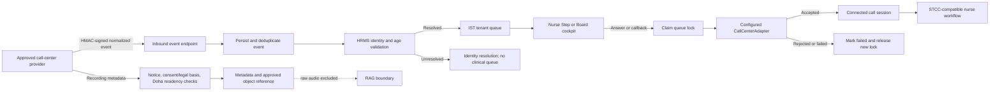

# Provider-Neutral Call Center Gateway

## What

The Provider-Neutral Call Center Gateway is the transport boundary between an approved telephone/contact-center platform and the IST Health tele-triage system.

It normalizes provider events, stores durable call-session and event metadata, creates HRMS-validated queue cases, and executes nurse call controls through a replaceable adapter. It does not select a clinical guideline, answer STCC assessment questions, determine a disposition, or approve care advice.

Implemented normalized events:

| Event | Meaning |
| --- | --- |
| `CALL_OFFERED` | A live inbound telephone call is offered to the triage queue. |
| `CALL_CONNECTED` | The provider confirms the call is connected. |
| `CALL_HELD` | The provider confirms the call is on hold. |
| `CALL_RESUMED` | A held call is connected again. |
| `CALL_ENDED` | The provider confirms call completion. |
| `CALLBACK_REQUESTED` | A caller or intake process requests a return call. |
| `CALLBACK_ANSWERED` | The outbound callback is connected. |
| `NO_ANSWER` | The live or callback attempt was not answered. |
| `RECORDING_AVAILABLE` | Governed recording metadata and an approved Qatar-hosted object reference are available. |

Implemented nurse/provider commands:

| Command | Queue behavior | Provider behavior |
| --- | --- | --- |
| `ANSWER` | Claim and lock the incoming case. | Answer the inbound call. |
| `START_CALLBACK` | Claim and lock the callback case. | Start an outbound callback. |
| `HOLD` | Keep the assigned case active. | Place the connected call on hold. |
| `RESUME` | Keep the assigned case active. | Resume the held call. |
| `END` | Preserve the case for clinical completion. | End call transport. |

## Why

The contact-center platform should own telephony transport, while IST Health owns clinical workflow and safety. This division:

- prevents provider lock-in;
- avoids a second, vendor-specific clinical queue;
- keeps HRMS identity, age, tenant routing, and queue locks in IST;
- keeps STCC-compatible protocol selection and deterministic safety floors outside telephony;
- preserves nurse authority over triage questions, disposition, care advice, and closing instructions;
- provides one auditable contract for incoming calls and callbacks;
- lets a provider adapter be replaced without rewriting the nurse cockpit.

## How



### Inbound contract

- Endpoint: `POST /api/v1/integrations/call-center/events`
- Authentication: HMAC-SHA256 over canonical JSON using `CALL_CENTER_GATEWAY_SECRET`
- Idempotency key: `provider + providerEventId`
- Sequence: verify, validate, persist, process, acknowledge
- ANI treatment: expose masked ANI only; retain a keyed hash for controlled correlation
- Arbitrary provider metadata: retain the sorted metadata keys, not uncontrolled provider values

### Tenant and identity routing

1. Resolve `organizationId` from an approved event mapping or `CALL_CENTER_DEFAULT_ORGANIZATION_ID`.
2. Validate `istStaffId` and any dependent relationship through the HRMS adapter.
3. Calculate age from HRMS data before nurse visibility.
4. Create one queue case only when identity succeeds.
5. Keep unknown callers in identity resolution; do not expose them as clinical cases.

Simulation uses `org_phcc` when no organization is supplied. Live mode requires an explicit default or approved provider/DNIS mapping.

### Nurse call control

- Endpoint: `POST /api/v1/call-center/queue/:queueItemId/command`
- Provider status: `GET /api/v1/call-center/status`
- Operational sessions: `GET /api/v1/call-center/sessions`
- The provider is resolved before the queue lock is taken.
- `ANSWER` and `START_CALLBACK` claim the case before transport execution.
- If a configured provider rejects or throws, a lock acquired by that command is released.
- An existing lock owned before the command is not silently removed.

### Recording governance

All-call recording is a governed operating policy, not an unconditional technical bypass. Before retaining a recording object reference, the gateway requires:

- the approved recording notice was played;
- a notice version;
- consent is `GRANTED` or an approved `LEGAL_BASIS` is recorded;
- guardian confirmation where policy requires it;
- storage region is GCP Doha `me-central1`;
- checksum and duration metadata when available;
- `ragEligible=false` for raw audio.

Raw call recordings do not enter clinical RAG. A separately governed pipeline may create a de-identified, nurse-reviewed transcript or evaluation row after purpose, retention, access, and clinical governance approval.

## Data Model

`CallCenterSession` stores provider-neutral state, queue linkage, masked caller identity, tenant/agent context, timestamps, and recording-governance metadata.

`CallCenterEvent` stores idempotent provider event identity, normalized type, processing state, safe payload, HMAC audit signature, and failure code.

The queue remains the authoritative source for nurse assignment, locks, clinical stage, protocol context, disposition, and completion.

## Current and Pending

### Implemented

- normalized event and command schemas;
- HMAC event verification and constant-time comparison;
- idempotent persist-before-process event handling;
- HRMS-validated queue ingress and unresolved-identity containment;
- dry-run provider adapter and health status;
- incoming answer and callback actions in the nurse cockpit;
- queue-lock rollback for provider failures;
- Prisma session/event models;
- recording notice, consent/legal basis, Doha residency, and RAG-boundary controls;
- integration and role-based UAT coverage.

### Pending production work

- approved provider-specific adapter and credentials;
- private provider connectivity, webhook allow-listing, and secret rotation;
- DNIS/queue-to-organization configuration UI;
- retry worker, backoff, dead-letter queue, and replay tooling;
- Cloud SQL migration and operational dashboards;
- GCS Doha recording bucket, CMEK, signed access, lifecycle, and retention policy;
- privacy/legal approval of notice, consent/legal basis, and quality-improvement use;
- incident runbook, availability targets, and provider failover test.

## Verification

The maintained integration scenarios are in `tests/callCenterGateway.test.ts`. Role-level positive and negative access checks are generated in `tests/roleUatMatrix.test.ts`.

```powershell
npx.cmd jest tests/callCenterGateway.test.ts tests/roleUatMatrix.test.ts --runInBand
npx.cmd tsc -p tsconfig.json --noEmit
npx.cmd tsc -p frontend/tsconfig.json --noEmit
```
