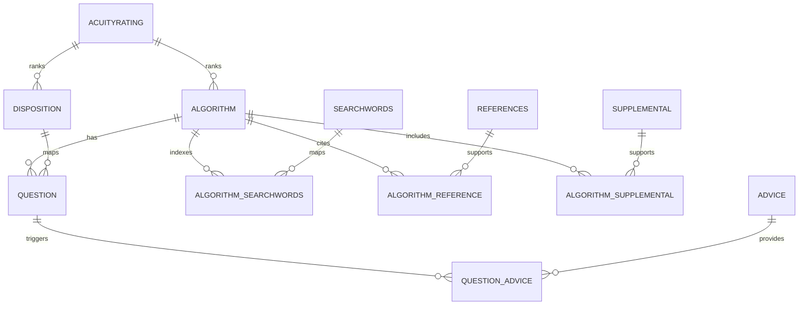

# STCC After-Hours Database Structure 2026 - Implementation Notes

Source PDF: `docs/After-Hours Telehealth Triage Guidelines Database Documentation 2026.pdf`

Status: structural interpretation for IST Health implementation planning.

This file documents the database shape and workflow concepts needed to align the IST Health tele-triage platform with the STCC after-hours telehealth triage database model. It is not a replacement for licensed STCC content, does not reproduce clinical guideline text, and must not be used as a clinical content source without the appropriate STCC license and local medical governance approval.

## Implementation status update (2026-07-21)

Structural schema fidelity (Part A of the STCC compatibility gap) was closed for the items below across `prisma/schema.prisma`, `src/types/clinicalContent.ts`, `python/generate_synthetic_stcc_guidelines.py`, and `src/scripts/importClinicalContent.ts`. Every addition is additive, parallel reference metadata: nothing here is read by the deterministic safety kernel (`severityMax`/`severityRank` in `src/types/triage.ts`, consumed by `src/services/dispositionRouter.ts`) — the 4-tier `TriageSeverity`/`AcuityDispositionCode` enums remain the sole authoritative clinical decision path.

- **`Disposition` model** — new lookup table for STCC's numeric disposition-level ladder (100 -> 15), seeded with the 11 canonical headings from the source PDF (level number, heading text, telemedicine heading variant, video-eligibility flag). `TriageQuestion` and `ProtocolDispositionMap` now carry an optional `dispositionLevelId` FK. `TriageQuestion` also gained an optional `questionOrder` second sort key, with a new `@@index([algorithmId, dispositionLevelId, questionOrder])` added *alongside* (not replacing) the existing `@@index([algorithmId, acuityOrder])`. The synthetic generator maps its 4 severity tiers onto 4 of the 11 levels (Emergency->100, Urgent->70, Routine->50, Self-care->15) as a documented approximation — real per-protocol STCC data would populate the full ladder.
- **`Algorithm.patientGroup`** — fixed a real data-loss bug: the generator already emitted `patientGroup` (adult/pediatric/mixed/unknown) and the Zod type already validated it, but there was no Prisma column and the importer silently dropped it on every import. Now a proper `PatientGroup` enum column, threaded through end-to-end.
- **`Algorithm.acuity`** (1-5) — new nullable column approximating STCC's guideline-level `AcuityRating`. Note: deriving this from "highest question severity" alone would be a constant `5` for all 1,684 synthetic protocols, since the generator's 4 severity tiers are identical on every protocol by construction. The generator instead blends `mode` (after-hours/office-hours) and taxonomy category (hospice/older-adult) to produce a value that actually varies (verified: 4/3/3/2 across test inputs) — still a synthetic approximation, not real STCC acuity.
- **`TriageQuestion.telemedicineEligible`/`telemedicineNotesEn`** — Prisma already had these columns; they were missing from the Zod type and never populated by the generator/importer. Now fully wired (`telemedicineEligible = severity !== "Emergency"`, matching the existing teleconsult narrative already present in the disposition-mapping generator).
- **Care-advice ordering + audience category** — `AlgorithmCareAdvice` bridge gained `displayOrder` (matching the identical pattern already used by `AlgorithmReference`/`AlgorithmSupplemental`); `CareAdvice` gained `patientSendable` (approximates STCC's `Advice.PatientHealthInfo`) and a `CareAdviceCategory` enum (DISPOSITION/NOTE_TO_TRIAGER/GENERAL/CALL_BACK_IF). The generator currently tags all synthetic advice `DISPOSITION` — it does not yet distinguish the other 3 STCC audience types.
- **Rich-text (XHTML) pass-through** — `CareAdvice.contentFormat`/`sanitizedHtmlEn`/`sanitizedHtmlAr` (already in Prisma) are now in the Zod type and importer; `ProtocolFirstAid`/`ClinicalSupplemental` already had `sanitizedHtmlEn`/`sanitizedHtmlAr` (no `contentFormat` column on those two) and are now wired the same way. The generator does not populate real HTML yet — purely additive, backward compatible with the existing embedded sample and the previously-generated 1,684-protocol package (both verified via `content:dry-run`).

**Explicitly deferred (Part B — content fidelity):** the actual per-protocol clinical question/care-advice depth (STCC guidelines average ~30 clinically-authored TAQs per protocol; this generator produces 4 templated ones per protocol regardless of topic). This is not an engineering gap — the generator is deliberately barred from copying licensed STCC question/advice text. Closing it requires a signed Schmitt-Thompson/ClearTriage license and the real data extract; tracked as GAP-001 through GAP-007 in `docs/stcc-rfi-rag-shadow-gap-tracker.md`.

**Required follow-up (cannot be completed in this environment):** this is the first-ever Prisma migration in the repo (`prisma/migrations/` did not exist before). `npx prisma validate` and `npx prisma generate` both succeed against the updated schema, and the full TS/Jest/`content:dry-run` suite passes, but the actual `npx prisma migrate dev --name add_stcc_structural_fields` run — which needs to connect to a live PostgreSQL to diff against the (nonexistent) migration history — could not be executed here (no Docker on this machine). Run it against a real dev database, review the generated SQL, and commit the resulting `prisma/migrations/` folder.

## 1. Purpose

The STCC after-hours database stores adult and pediatric telehealth triage guideline content for medical call centers. The documented delivery format is a Microsoft Access database, with separate adult and pediatric databases that share the same structure.

For IST Health, the relevant implementation pattern is:

1. Caller reason for call is captured.
2. Search words map the reason to one or more candidate algorithms/protocols.
3. The nurse selects the correct protocol.
4. Initial assessment and emergency rule-out are reviewed first.
5. Triage assessment questions are presented by acuity.
6. A positive answer fixes the disposition.
7. Care advice is selected and documented.
8. The encounter is summarized into SBAR/SOAP and routed through local Qatar/aviation rules.

## 2. Core Database Tables

The source document lists 14 tables.

| STCC table | Purpose | IST Health mapping |
| --- | --- | --- |
| `AcuityRating` / `Acuity` | Lookup for numeric acuity score from 1 to 5. Used by Algorithm and Disposition. | `Algorithm.acuity` concept, queue priority, candidate protocol ranking. |
| `Advice` | Care advice for guidelines. Includes display/send eligibility concepts. | `CareAdvice`, `AlgorithmCareAdvice`, `QuestionAdviceBridge`. |
| `Algorithm` | Primary guideline/protocol table. Stores metadata, definition, background, first aid, age/gender selection, category, type, system, anatomy, status, and acuity. | `Algorithm`, `ProtocolRelease`, `ProtocolKeywordIndex`, `ProtocolSynonym`, future first-aid/supplemental/reference fields. |
| `AlgorithmReference` | Bridge between Algorithm and Reference. | Future `AlgorithmReference` or evidence-reference import model. |
| `AlgorithmSearchwords` | Bridge between Algorithm and Searchword. | `ProtocolKeywordIndex` and `ProtocolSynonym`. |
| `AlgorithmSupplemental` | Bridge between Algorithm and Supplemental. | Future supplemental-content bridge. |
| `Disposition` | Disposition levels and headings such as emergency, ED, PCP, home care, plus telemedicine heading fields. | `AcuityDispositionCode`, `ProtocolDispositionMap`, Qatar route mapping, teleconsult eligibility. |
| `Question` | Triage assessment questions for a guideline. | `TriageQuestion` and `QueueProtocolQuestionPreview`. |
| `QuestionAdvice` | Bridge from question to advice. | `QuestionAdviceBridge`. |
| `Reference` | Evidence references for clinical leadership. | Future reference/evidence table. |
| `Searchwords` | Search metadata and keywords. | `ProtocolKeywordIndex`, `ProtocolSynonym`. |
| `Supplemental` | Non-guideline supplemental content such as dosage tables and reviewer lists. | Future supplemental library model. |
| `System` | Lookup for sorting/selecting/reporting guidelines by body system. | `Algorithm.system` concept or protocol taxonomy. |
| `Type` | Lookup for sorting/selecting/reporting guidelines by type. | `Algorithm.type` concept or protocol taxonomy. |

## 3. Important Field Concepts

### Algorithm

The Algorithm table is the primary protocol record. The PDF shows metadata and content fields including:

- Unique algorithm ID
- Author and copyright
- Created, updated, reviewed, and content-specific last-update dates
- Title and uppercase title
- Definition plain text and XHTML
- Initial assessment questions
- Background plain text and XHTML
- First aid plain text and XHTML
- Reference, search-word, question, and care-advice last-update dates
- Category, group, type, system, anatomy, version year, and status
- Numeric acuity
- Gender-at-birth applicability
- Age group and minimum/maximum age in years/months
- Specialty flags such as women's health, behavioral health, older adult, chronic disease, hospice, oncology, and prescription option

IST Health currently models the core clinical footprint through `Algorithm`, but should add import-safe storage for first-aid content, supplemental content, reference links, category/group/type/system/anatomy taxonomy, telemedicine flags, and record-level STCC change metadata before a licensed import is attempted.

### Question

The Question table contains triage assessment questions. Key concepts for the UI and engine:

- Questions belong to an algorithm.
- Questions map to a disposition level.
- Questions have an order inside that disposition level.
- Questions may include nurse-facing information/rationale.
- Questions may have telemedicine eligibility.
- A "Yes" answer to a question fixes the disposition for that level.
- A "No" answer continues to the next available question.

The documented ordering rule is:

```sql
ORDER BY Question.DispositionLevel DESC, Question.QuestionOrder ASC
```

IST Health should continue using a one-active-question flow:

1. Emergency/highest acuity question appears first.
2. Nurse answers Yes or No.
3. Yes stops lower-priority questions and fixes the route.
4. No unlocks the next question.
5. If no disposition is triggered, the lowest safe/self-care route is reached.

### Disposition

The Disposition table stores disposition levels and headings. The document also describes optional telemedicine disposition headings and a video eligibility flag.

IST Health should map STCC dispositions into local destinations:

- Emergency pediatric routes to Sidra Medicine Emergency Department.
- Emergency adult/general routes to HMC Emergency Department.
- Urgent routes to HMC urgent review or approved PHCC/teleconsult workflow.
- Routine/staff routes to IST Health medical center or teleconsult workflow.
- Self-care routes to nurse-guided callback precautions.

The STCC clinical disposition must be calculated first. IST Health fit-to-fly and duty decisions are local overlays and cannot downgrade the clinical route.

### Advice

The Advice table stores care advice. The source document distinguishes patient-facing care advice from notes or disposition text. IST Health should preserve this distinction:

- Advice that can be given verbally during the call.
- Advice that can be sent later through an approved channel.
- Notes intended for the triager only.
- Disposition-related advice.

Employee-facing CCP/WhatsApp/SMS/email messages must remain nurse-approved before sending.

### XHTML and Plain Text

The document states that larger content fields are stored as both XHTML and plain text. IST Health should keep both display-safe HTML/XHTML and plain text where licensed content is imported:

- Plain text for search, testing, audit, SBAR drafting, and LLM-safe context.
- Sanitized HTML/XHTML for nurse-facing display where formatting matters.

## 4. Relationship Model



## 5. Import Design for IST Health

Recommended import sequence:

1. Import release metadata into `ProtocolRelease`.
2. Import lookup tables: acuity, disposition, system, type, category/taxonomy.
3. Import `Algorithm` records and preserve source IDs/version metadata.
4. Import search words and algorithm-search bridges.
5. Import references and supplemental content.
6. Import questions sorted by disposition level and question order.
7. Import advice records.
8. Import question-advice bridges.
9. Build local Qatar disposition overlays.
10. Run validation checks for duplicates, missing relationships, invalid age/gender ranges, missing dispositions, and out-of-order questions.

## 6. Current IST Health Alignment

Already aligned:

- `Algorithm`, `TriageQuestion`, `CareAdvice`, `QuestionAdviceBridge`, and `AlgorithmCareAdvice` exist.
- Protocol search and care advice endpoints exist.
- The nurse workspace uses a simplified action flow: `Reason & Emergency`, `Questions`, `Disposition`, `SBAR / Complete`.
- HRMS identity and age are auto-resolved before nurse triage.
- Questions are shown one at a time in acuity order.
- Yes fixes the provisional disposition; No unlocks the next acuity item.
- Board and Step cockpits share the queue orchestration API.
- Local Qatar/aviation routing is layered after the clinical disposition.

Needs alignment before licensed STCC import:

- Add explicit STCC source fields for category, group, type, system, anatomy, source status, source update dates, and source acuity.
- Add first-aid content fields to `Algorithm` or a related protocol-content table.
- Add reference and supplemental tables/bridges.
- Add telemedicine eligibility at question and disposition levels.
- Add sanitized XHTML/HTML storage alongside plain text for display fields.
- Add annual release reconciliation support for local edits versus new STCC updates.
- Add import validation reports for every relationship and duplicate key.

## 7. UI Workflow Derived From Structure

The nurse-facing workflow should remain simple:

1. Incoming call enters the queue after HRMS validation.
2. Nurse opens one call.
3. Reason narrative is reviewed.
4. Keyword search prepares candidate protocols.
5. Emergency rule-out is checked first.
6. Nurse selects or confirms the protocol.
7. Assessment questions appear one at a time in acuity order.
8. Yes response fixes the route and stops lower-priority questioning.
9. Care advice is selected from mapped advice.
10. Local destination, fit-to-fly/duty status, and callback requirements are reviewed.
11. SBAR/SOAP is copied, written back when enabled, and the call is completed.

## 8. Governance Rules

- Licensed STCC content must not be modified casually.
- Local changes to questions, dispositions, or telemedicine eligibility need clinical leadership approval.
- Annual STCC updates must be reconciled against local overrides.
- STCC does not provide an API or SDK; IST Health must import the Access database into its own governed schema.
- The imported content should be treated as clinical content, not sample data.
- AI/LLM features may summarize or explain, but cannot change deterministic disposition logic.

## 9. Line Comparison Method

The companion comparison report is:

`docs/stcc-after-hours-database-structure-2026-line-compare.md`

That report compares the extractable PDF text to this Markdown file by page and line number. It intentionally uses line hashes and coverage classifications instead of reproducing every copyrighted PDF line.
