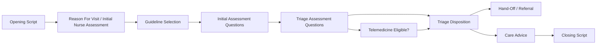
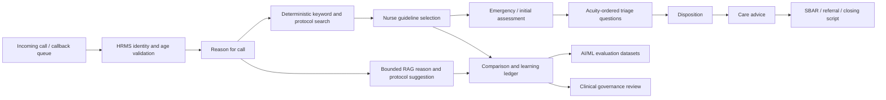

# STCC-Compatible RAG Shadow Architecture and Plan of Action

Status: backend process snapshot, bounded RAG shadow contract, and STCC-compatible persistence schema implemented; licensed STCC import pending

Last reviewed: 2026-07-17

This document defines the refined architecture for aligning IST Health with a fully STCC-compatible clinical content model while introducing a bounded LLM/RAG shadow layer for learning, comparison, and nurse assistance. The backend now exposes the STCC process snapshot and RAG shadow contract in queue DTOs. It does not reproduce licensed STCC clinical content and must not be treated as a substitute for a licensed STCC database, clinical governance approval, or local medical validation.

## 1. Objective

Build the platform toward a fully STCC-compatible operating model:

```text
Incoming call
  -> HRMS identity and age validation
  -> opening script
  -> reason for call
  -> search words and keyword match
  -> guideline selection
  -> initial/emergency assessment
  -> acuity-ordered triage questions
  -> disposition
  -> care advice
  -> hand-off/referral
  -> closing script
  -> SBAR and audit closure
```

At the same time, run a bounded LLM/RAG layer in parallel during the early encounter. The LLM/RAG layer may suggest, compare, explain, and learn, but it must not become the clinical decision engine.

## 1.1 STCC Telehealth Triage Encounter Process

The STCC-compatible operating process is a nurse-led swimlane. IST Health must preserve this clinical sequence even when the UI uses simplified action tabs.



### Process Detail

| STCC-compatible step | What happens | IST Health implementation |
| --- | --- | --- |
| Opening Script | The nurse gives a friendly greeting, introduction, and call purpose. | Approved opening script is shown in the first action tab. The system already knows the caller context from the queue. |
| Reason For Visit / Initial Nurse Assessment | The nurse records the caller's reason in the caller's own words and identifies primary and secondary chief complaints. | `reasonNarrative`, prepared protocol search, queue context, channel, wait time, staff/dependent status, station, duty state, and HRMS age validation are shown together. |
| Guideline Selection | The nurse uses search words and clinical judgment to select the best triage guideline. | Deterministic search uses approved keyword indexes, synonyms, age, sex, mode, and red-flag terms. Bounded RAG may suggest candidates, but nurse confirmation remains required. |
| Initial Assessment Questions | The nurse references or uses initial assessment questions to identify immediate risk before detailed assessment. | Emergency safety floors check SpO2, respiratory rate, heart rate, consciousness, pediatric danger signs, severe symptoms, and other red-floor triggers before lower-acuity work. |
| Triage Assessment Questions | The nurse performs a detailed assessment using the selected guideline. | The Questions tab presents one active question at a time in high-to-low acuity order. A Yes fixes the disposition; a No unlocks the next item. |
| Telemedicine Eligible? | The system/nurse notes whether the case is suitable for telemedicine based on guideline and local policy. | `telemedicineEligible`, telemedicine notes, and disposition-level telemedicine headings are supported in the schema. This is an indicator, not an override of safety floors. |
| Triage Disposition | The nurse reaches the clinical disposition and source-of-care recommendation. | STCC-shaped disposition sets the clinical floor. Qatar routing maps it to HMC, Sidra, PHCC, IST Health medical review, teleconsult, outstation escalation, or self-care. |
| Hand-Off / Referral | If the case needs urgent care, ED, physician, clinic, or another service, the nurse completes the handoff. | SBAR/SOAP draft, CCP follow-up, referral target, route rationale, and audit trace are prepared for clinician-approved handoff. |
| Care Advice | The nurse gives targeted care advice, first aid, health information, callback precautions, or send-later advice. | `CareAdvice`, `QuestionAdviceBridge`, `ProtocolFirstAid`, and localized route advice hold approved content. Employee-facing messages still require nurse approval before CCP send. |
| Closing Script | The nurse gives closing instructions and callback/return precautions. | Closing script, SBAR completion, care-advice confirmation, and CCP callback/follow-up tasks close the encounter. |

STCC FAQ material describes a typical telehealth triage encounter as an approximately 11 to 13 minute call, with variation from chief complaint, patient age/context, nurse experience, and UI efficiency. IST Health should treat this as a planning benchmark, not a contractual SLA.

### Simplified IST Health Action Tabs

The product should keep the nurse UI simple while preserving the STCC process:

| Visible IST Health action tab | STCC process contained inside |
| --- | --- |
| Reason and Emergency Rule-Out | Opening script, reason for visit, initial nurse assessment, guideline search, guideline selection, initial/emergency assessment questions |
| Questions | Initial assessment questions, triage assessment questions, telemedicine eligibility indicator, high-to-low acuity sequence |
| Disposition and Care Advice | Triage disposition, source of care, Qatar route, fit-to-fly overlay, mapped care advice, first aid, handoff/referral |
| SBAR / Complete | Closing script, callback precautions, CCP follow-up, SBAR/SOAP note, audit closure |

The RAG shadow layer runs beside the first two visible tabs only: reason extraction, keyword/search-word match, candidate guideline ranking, and comparison with nurse selection. It must not independently set disposition, source of care, first aid, care advice, or closing instructions.

## 2. Non-Negotiable Safety Principles

1. STCC or STCC-shaped content is the clinical content source.
2. Deterministic rules decide emergency floors, question ordering, and minimum permitted disposition.
3. The nurse remains the human clinical decision owner.
4. LLM/RAG is advisory and shadow-mode unless explicitly approved for a narrow non-clinical assistive task.
5. LLM/RAG cannot invent questions, dispositions, care advice, or local routes.
6. LLM/RAG cannot downgrade emergency, urgent, pediatric, aviation, or other safety-floor outcomes.
7. RAG retrieval must be limited to approved indexed content.
8. Every disagreement between nurse, deterministic system, and LLM/RAG must be recorded for governance and learning.
9. Employee-facing messages must remain nurse-approved before WhatsApp, SMS, email, or CCP send.
10. Licensed STCC content must be imported, versioned, and reconciled without casual modification.

## 3. Target Architecture



### 3.1 Current Backend Implementation

The queue API now returns a `stccProcess` snapshot for every queue item. This maps the STCC telehealth encounter process into the product's four visible nurse action tabs while preserving the canonical underlying process:

- Opening Script
- Reason for Visit / Initial Nurse Assessment
- Guideline Selection
- Initial Assessment Questions
- Triage Assessment Questions
- Telemedicine Eligible
- Triage Disposition
- Care Advice
- Hand-Off / Referral
- Closing Script

The queue API also returns `preparedProtocol.ragShadow` when a reason narrative is evaluated. This is a dry-run shadow suggestion derived only from approved clinical content candidates. It includes retrieved source IDs, snippet hashes, confidence, protocol agreement status, and explicit flags that the shadow layer cannot decide disposition and requires nurse review.

### 3.2 Help and Library Implementation

The in-app Help/Library now documents the complete process in the same terms as this architecture:

- **Call Flow** describes the end-to-end telehealth triage encounter: incoming queue, HRMS age validation, opening script, reason for call, keyword search, guideline selection, emergency rule-out, acuity-ordered questions, disposition/source of care, care advice, closing script, SBAR, and audit.
- **Clinical Protocol Library** explains the STCC-compatible data shape: algorithms, questions, search words, taxonomy, care advice, first aid, references, supplementals, source lineage, and localized routing overlay.
- **STCC-Compatible RAG Shadow Architecture** explains the AI/ML boundary: retrieval is limited to approved content, LLM suggestions are advisory, unsafe output is blocked, and nurse/system/LLM comparison is stored for governance.
- **Data Ingestion and QA** explains import readiness, duplicate checks, row counts, bridge validation, source hashes, and release activation.
- **Prisma Data Model** lists the canonical persistence structures and deprecated compatibility fields that must be retired only after importer/runtime migration.

This keeps user-facing help, technical library, schema, and implementation plan aligned.

## 4. Layered Data Design

The database should separate the source content, canonical runtime content, local overlays, and learning data.

### 4.1 STCC Source Layer

Purpose: preserve imported licensed STCC structures and source identity.

Required domains:

| Domain | Required concepts |
| --- | --- |
| Release | release year, source type, checksum, imported date, active flag |
| Algorithm | source algorithm ID, title, definition, background, first aid, age/sex rules, status, acuity |
| Question | source question ID, disposition level, question order, text, rationale, telemedicine eligibility |
| Advice | advice ID, care advice text, home care advice, display/send eligibility |
| Search words | keyword, synonym, source ID, algorithm bridge, weight |
| Disposition | disposition level, heading, source-of-care wording, telemedicine heading |
| Reference | evidence/reference metadata and algorithm bridge |
| Supplemental | dosage tables, appendices, reviewer notes, non-guideline content |
| Taxonomy | category, group, type, system, anatomy, specialty flags |
| Text formats | plain text plus sanitized XHTML/HTML where available |

### 4.2 Canonical Runtime Clinical Layer

Purpose: provide stable application contracts independent of the imported STCC physical format.

Current foundation:

- `Algorithm`
- `TriageQuestion`
- `CareAdvice`
- `QuestionAdviceBridge`
- `AlgorithmCareAdvice`
- `ProtocolKeywordIndex`
- `ProtocolSynonym`
- `ProtocolDispositionMap`
- `LocalizedDisposition`
- `ProtocolRelease`
- `ClinicalContentImportJob`
- `ClinicalContentImportError`

Implemented schema alignment additions:

- `ClinicalReference`
- `AlgorithmReference`
- `ClinicalSupplemental`
- `AlgorithmSupplemental`
- `ProtocolTaxonomy`
- `ProtocolFirstAid`
- sanitized XHTML/plain text pairs on advice, supplementals, and first-aid items
- question-level telemedicine eligibility and notes
- disposition-level telemedicine headings and source-of-care wording
- STCC source record hashes/checksums and annual reconciliation metadata

Deprecated compatibility fields retained until importer and runtime code fully migrate:

- `Algorithm.stccVersion`: use `ProtocolRelease.version` through `releaseId`.
- `Dependent.age`: calculate age from HRMS/dependent date of birth at runtime.
- `AviationTriageEncounter.initialAcuityScore`: use `finalDispositionCode` plus safety trace lineage.
- `ApplicationUser.organization`: use `organizationId` and `organizationRef` for canonical tenant joins.

### 4.3 Qatar and Aviation Overlay Layer

Purpose: local routing and occupational context after the STCC clinical disposition is fixed.

Examples:

- pediatric emergency routes to Sidra Medicine Emergency Department
- adult emergency routes to HMC Emergency Department
- urgent route to HMC urgent review or approved PHCC/teleconsult path
- routine staff route to approved clinic/teleconsult workflow
- self-care with callback precautions
- fit-to-fly restriction
- duty status and outstation handling
- sickness validation and occupational health routing

This overlay must never downgrade the STCC clinical disposition.

### 4.4 RAG and Learning Layer

Purpose: keep advisory LLM output and comparison evidence separate from clinical source data.

Implemented records:

| Record | Purpose |
| --- | --- |
| `RagRetrievalEvent` | stores retrieved source IDs, versions, snippets hashes, confidence, and query |
| `LlmShadowSuggestion` | stores LLM extracted reason, keywords, suggested protocols, and rationale |
| `NurseSelectionEvent` | stores nurse-selected guideline and reason |
| `ProtocolComparisonEvent` | compares deterministic search, LLM/RAG suggestion, and nurse selection |
| `LearningFeedbackEvent` | marks whether weights, synonyms, prompts, or no changes are needed |
| `ModelEvaluationRun` | tracks model/prompt version, dataset version, metrics, failures |
| `SafetyBlockedOutput` | records unsafe model output such as downgrade attempts or invented advice |

## 5. Parallel Early-Encounter Design

The following early activities can run in parallel while preserving clinical safety.

| Activity | Deterministic system | Nurse | Bounded LLM/RAG | Comparison and learning |
| --- | --- | --- | --- | --- |
| Incoming call / callback queue | creates queue item, timestamp, channel, SLA, lock | selects one call | summarizes non-PHI call metadata if allowed | compare queue priority vs predicted complaint priority |
| HRMS identity and age validation | validates staff/dependent, DOB, age, sex, eligibility | confirms caller context when needed | may extract caller-stated identity but cannot validate identity | record mismatch between caller statement and HRMS |
| Opening script | loads approved script by language/channel | reads or adapts script within policy | suggests bilingual phrasing from approved script only | record script deviation or missing language support |
| Reason for call | stores narrative and normalized terms | clarifies and edits reason | extracts symptom, duration, body part, red flags, keyword candidates | compare nurse reason vs LLM extraction vs deterministic terms |
| Keyword/search-word match | searches approved STCC keyword index | reviews suggested protocols | retrieves only from approved STCC-bounded corpus | compare ranked candidates and reasons |
| Guideline selection | presents candidate protocols with age/sex/mode filters | selects final guideline | suggests likely guideline with citations/source IDs | mark full match, partial match, or disagreement |

## 6. RAG Boundary

### Allowed Retrieval Sources

- licensed STCC content after import
- synthetic STCC-shaped demo content, clearly tagged as synthetic
- IST-approved local Qatar route overlays
- approved fit-to-fly and aviation medicine rules
- approved opening and closing scripts
- approved care advice and callback precautions
- approved bilingual terminology and script wording

### Disallowed Retrieval Sources

- open web medical advice during a live encounter
- unapproved internet content
- general LLM medical memory
- nurse notes from unrelated employees unless explicitly linked and permitted
- raw PHI not needed for the current encounter
- unapproved generated questions or care advice

### RAG Output Contract

Every RAG suggestion should include:

- source type
- source release/version
- source record IDs
- retrieved section type
- confidence
- reason extraction
- suggested search terms
- suggested protocol candidates
- prohibited-action acknowledgement
- `cannot_decide_disposition: true`
- `requires_nurse_review: true`

## 7. Nurse Workflow Design

Keep the visible workflow simple:

1. Reason and Emergency Rule-Out
2. Questions
3. Disposition and Care Advice
4. SBAR / Complete

Map the STCC process inside those action tabs:

| Visible tab | STCC subprocesses |
| --- | --- |
| Reason and Emergency Rule-Out | opening script, reason for visit, initial nurse assessment, search words, guideline selection, emergency rule-out |
| Questions | initial assessment questions, triage assessment questions, telemedicine eligibility, high-to-low disposition levels |
| Disposition and Care Advice | clinical disposition, Qatar route, fit-to-fly overlay, mapped care advice, first aid where appropriate |
| SBAR / Complete | hand-off/referral, closing script, callback precautions, SBAR/SOAP, CCP follow-up |

## 8. AI/ML Learning Design

The learning engine should learn from comparison outcomes, not from replacing the clinical engine.

Training/evaluation datasets:

| Dataset | Purpose |
| --- | --- |
| reason normalization | teach symptom/body part/duration extraction |
| keyword ranking | compare deterministic keyword matches with nurse final guideline |
| protocol suggestion | evaluate candidate protocol ranking |
| question-path trace | verify high-acuity first behavior and stop-on-yes behavior |
| care-advice retrieval | verify advice maps only from approved protocol/question/disposition |
| route explanation | teach local Qatar and aviation overlay explanation |
| safety failure cases | ensure the LLM cannot downgrade safety floors |
| bilingual drafting | evaluate English/Arabic explanation and SBAR text |

Model metrics:

- protocol top-1 agreement with nurse
- protocol top-3 agreement with nurse
- keyword precision and recall
- unsafe downgrade rate, target 0
- invented question/advice rate, target 0
- citation coverage
- nurse correction rate
- pediatric/female-health/male-health/older-adult/behavioral coverage
- Qatar aviation overlay explanation accuracy

## 9. Activity Task List

### Workstream A: STCC-Compatible Database Alignment

| Task | Activity | Acceptance criteria |
| --- | --- | --- |
| A1 | Finalize STCC source-to-canonical mapping | every STCC table has target table/field or explicit exclusion |
| A2 | Add reference and supplemental models | references and supplemental content can be imported and linked to algorithms |
| A3 | Add taxonomy and status metadata | category, group, type, system, anatomy, specialty flags, status, and update dates are represented |
| A4 | Add first-aid and XHTML/plain text support | first aid and formatted content can be stored safely |
| A5 | Add telemedicine eligibility fields | question and disposition telemedicine concepts are represented |
| A6 | Add release reconciliation metadata | annual updates can compare source, local overlay, and approved override |

### Workstream B: Import and Validation Pipeline

| Task | Activity | Acceptance criteria |
| --- | --- | --- |
| B1 | Build raw STCC staging import | source tables can be loaded without transformation loss |
| B2 | Build normalized import | canonical runtime tables are populated from staging |
| B3 | Add duplicate detection | duplicate algorithms, questions, advice, search words, and bridges are reported |
| B4 | Add relationship validation | missing algorithm/question/advice/reference bridges fail validation |
| B5 | Add ordering validation | questions sort by disposition level and order |
| B6 | Add source checksum and row counts | import report proves lineage and reproducibility |

### Workstream C: Bounded RAG Shadow Layer

| Task | Activity | Acceptance criteria |
| --- | --- | --- |
| C1 | Define RAG corpus manifest | only approved source collections are indexable |
| C2 | Build retrieval adapter contract | backend returns source IDs, versions, and citation metadata |
| C3 | Build shadow suggestion contract | LLM returns extracted reason, keywords, protocol candidates, and safety acknowledgement |
| C4 | Add prohibited-output validator | invented questions, invented advice, and downgrades are blocked |
| C5 | Add comparison ledger | nurse/system/LLM differences are stored with reason codes |
| C6 | Add dry-run-only mode | RAG can run without changing clinical workflow state |

### Workstream D: Nurse Workflow Alignment

| Task | Activity | Acceptance criteria |
| --- | --- | --- |
| D1 | Add opening and closing script support | approved scripts appear in the relevant action tabs |
| D2 | Improve guideline candidate view | deterministic and RAG candidates are visible but nurse chooses final guideline |
| D3 | Preserve one-question-at-a-time flow | Yes fixes disposition; No unlocks next high-to-low question |
| D4 | Add care-advice action panel | give-now/send-later/nurse-note distinctions are visible |
| D5 | Show telemedicine eligibility | eligibility is shown as an indicator, not a decision override |
| D6 | Align Board and Step labels | both views use the same action language and same queue source |

### Workstream E: AI/ML Evaluation and Learning

| Task | Activity | Acceptance criteria |
| --- | --- | --- |
| E1 | Build synthetic STCC-shaped evaluation corpus | adult, pediatric, behavioral, women, male, chronic, older-adult, and aviation cases are covered |
| E2 | Add comparison export | disagreement records export to JSONL without PHI |
| E3 | Add model scorecard | unsafe downgrade, hallucination, citation, and agreement metrics are reported |
| E4 | Add prompt/version registry | each model output links to model, prompt, corpus, and policy version |
| E5 | Add nurse correction taxonomy | corrections distinguish keyword issue, protocol rank issue, clinical override, or no model issue |
| E6 | Add regression suite | model changes cannot pass if safety or citation tests fail |

### Workstream F: Governance, Privacy, and Operations

| Task | Activity | Acceptance criteria |
| --- | --- | --- |
| F1 | Define licensed content governance SOP | STCC source content, local overlay, and approved changes are separated |
| F2 | Define AI use policy | allowed and prohibited LLM actions are documented in Help/Library |
| F3 | Define privacy boundary | PHI masking, retention, reveal workflow, and audit are documented |
| F4 | Define clinical review workflow | protocol changes and RAG shadow suggestions require role-based approval |
| F5 | Define cloud deployment controls | GCP Doha private endpoint, IAM, KMS, audit logs, and VPC controls are planned |
| F6 | Define rollback plan | failed import, unsafe model output, or bad release can be reverted |

## 10. Suggested Delivery Milestones

### Milestone 1: Design Lock

- approve this architecture
- approve STCC data model extension list
- approve RAG boundary
- approve nurse action tabs
- approve AI/ML evaluation metrics

### Milestone 2: Database and Import Readiness

- add schema extensions
- build importer staging
- build validation reports
- run synthetic import
- generate import lineage report

### Milestone 3: RAG Shadow Pilot

- index synthetic STCC-shaped content
- run LLM/RAG in dry-run shadow mode
- show nurse/system/LLM comparison
- export learning events
- block unsafe outputs

### Milestone 4: Clinical UAT

- run adult and pediatric pathways
- run emergency, urgent, routine, and self-care cases
- run fit-to-fly overlay cases
- run telemedicine eligibility cases
- run nurse correction and disagreement scenarios

### Milestone 5: Licensed STCC Import Readiness

- confirm license and permitted use
- import licensed Access database into staging
- validate rows and relationships
- reconcile local overlays
- run clinical governance sign-off

## 11. Key Open Decisions

1. Whether to store raw STCC tables permanently or only during import.
2. Whether XHTML should be stored in the main clinical tables or a separate content block table.
3. Whether telemedicine eligibility should be a question field, disposition field, or both.
4. Whether RAG indexing should use canonical runtime content only or include raw STCC source records.
5. What exact nurse correction reason taxonomy should drive learning.
6. Which model provider will be used for dry-run RAG and later GCP Doha deployment.
7. What minimum model scorecard is required before any UAT demonstration.

## 12. Current Definition of Done

This architecture has moved past design lock. The next definition of done is implementation readiness for importer, migration, and UAT:

- STCC-compatible schema additions are implemented and validated.
- Deprecated compatibility fields have a migration path and are not removed until runtime/importer code no longer depends on them.
- RAG is explicitly bounded to approved content and stored in a separate learning ledger.
- LLM output is advisory, cited, logged, and blocked from clinical authority.
- Nurse workflow remains simple and action-based.
- Help/Library explains STCC structure, RAG shadow mode, role responsibilities, privacy, audit, and safety floors.
- Importer work can populate references, supplementals, first aid, taxonomy, telemedicine flags, source hashes, and comparison ledgers.
- Test plan includes positive and negative role, safety, protocol, care advice, importer, and AI/ML cases.
